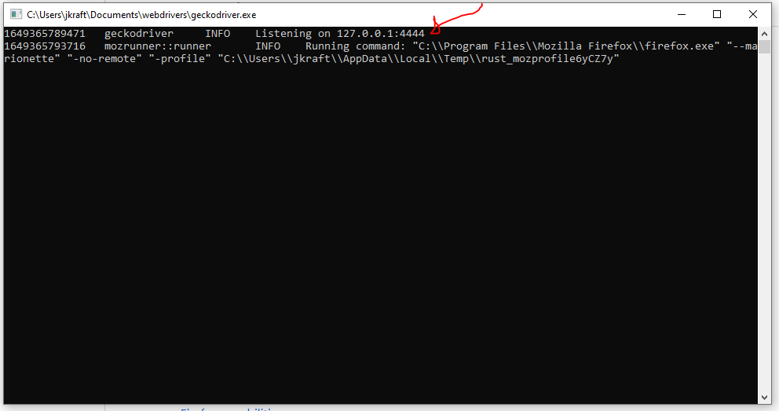

# Purpose: 

The purpose of this tool is to allow web developers to get a high level overview of website performance, and track 404 links. More functionality to come. . . 

# Setup: 

Using Gecko Driver:
1. If Firefox is not installed. Install: https://www.mozilla.org/en-US/firefox/new/
2. Download and install geckodriver: https://github.com/mozilla/geckodriver (downloads under releases)
3. Open the executable and confirm webdriver is running on port 4444
